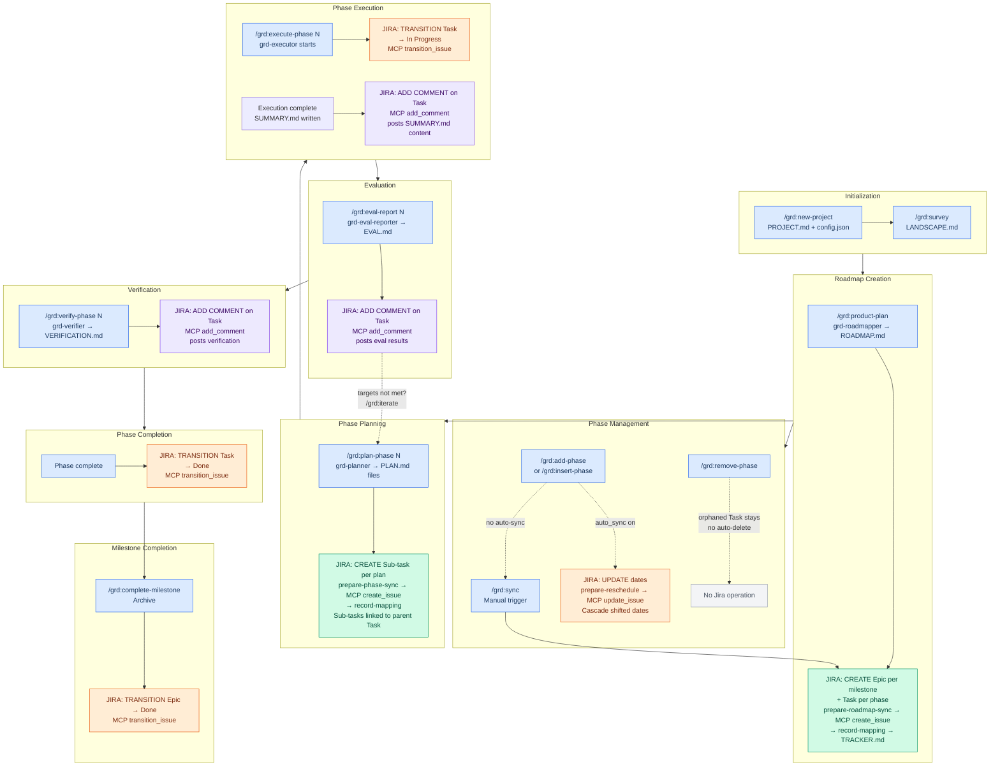
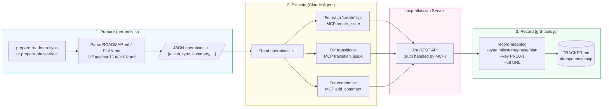
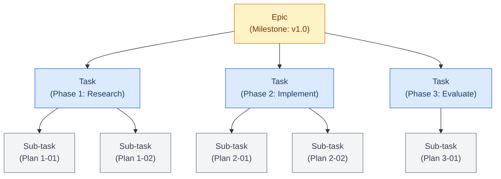
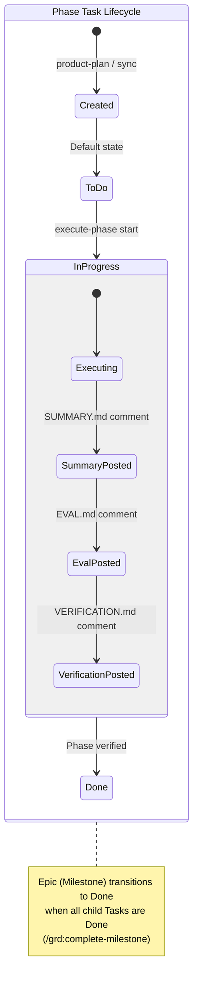

# GRD Workflow — Jira (mcp-atlassian) Integration

## Mapping Hierarchy

| GRD Concept | Jira Object | Config Key |
|-------------|-------------|------------|
| Roadmap | Plan (conceptual) | — |
| Milestone | Epic | `milestone_issue_type` |
| Phase | Task (child of Epic) | `phase_issue_type` |
| Plan | Sub-task (child of Task) | `plan_issue_type` |

## Full Workflow with Tracker Operations

## Color Legend

| Color | Meaning |
|-------|---------|
| Blue | GRD commands/steps |
| Green | Jira CREATE operations (Epic, Task, Sub-task) |
| Orange | Jira TRANSITION operations (In Progress, Done) |
| Purple | Jira COMMENT operations (Summary, Eval, Verification) |
| Gray | No Jira operation |

## Data Flow: Prepare → Execute → Record

## Jira Object Hierarchy

## Jira Object Lifecycle

## Operation Matrix

| GRD Command | Jira Operation | MCP Tool | Object |
|-------------|---------------|----------|--------|
| `/grd:product-plan` | CREATE Epic per milestone + Task per phase | `create_issue` | Epic, Task |
| `/grd:sync roadmap` | CREATE missing Epics + Tasks | `create_issue` | Epic, Task |
| `/grd:add-phase` | UPDATE dates (reschedule) | `update_issue` | Task (dates) |
| `/grd:insert-phase` | UPDATE dates (reschedule) | `update_issue` | Task (dates) |
| `/grd:sync reschedule` | UPDATE dates (cascade) | `update_issue` | Epic, Task (dates) |
| `/grd:remove-phase` | (none — orphaned Task stays) | — | — |
| `/grd:plan-phase N` | CREATE Sub-task per plan | `create_issue` | Sub-task → Task |
| `/grd:sync phase N` | CREATE missing Sub-tasks | `create_issue` | Sub-task → Task |
| `/grd:execute-phase N` (start) | TRANSITION → In Progress | `transition_issue` | Task |
| `/grd:execute-phase N` (end) | ADD COMMENT (summary) | `add_comment` | Task |
| `/grd:eval-report N` | ADD COMMENT (eval) | `add_comment` | Task |
| `/grd:verify-phase N` | ADD COMMENT (verification) | `add_comment` | Task |
| Phase verified | TRANSITION → Done | `transition_issue` | Task |
| `/grd:complete-milestone` | TRANSITION → Done | `transition_issue` | Epic |
